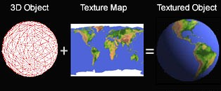
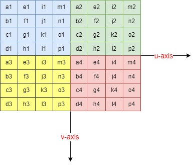
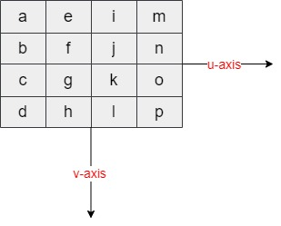
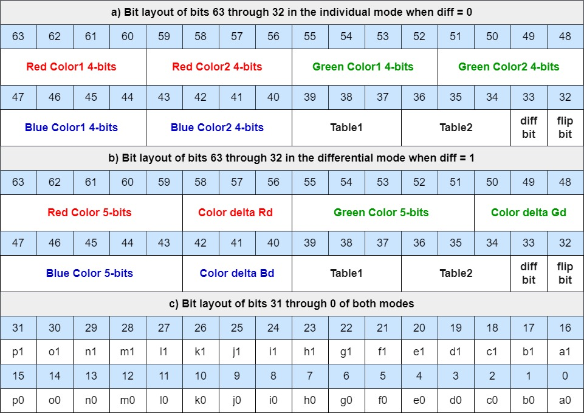
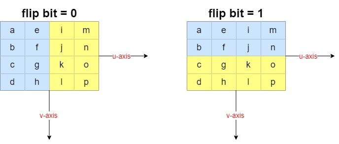
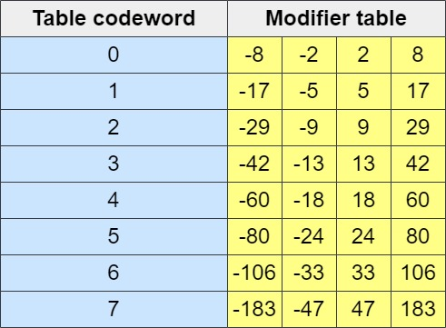
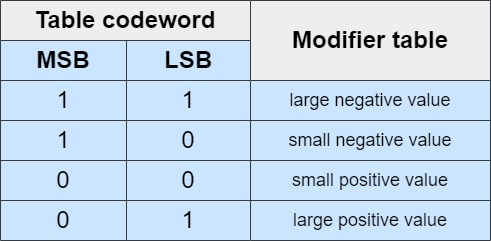

# Volcano 3d rendering system
## Texture Mapping Unit
Texture Mapping is a way of adding realism to a 3D model by defining high-frequency detail, surface texture, or color information on the model. In this process, a 2D surface, also called a "Texture Map", is wrapped around a 3D model. This process is also called as diffuse mapping.

### The Basics of Texture Mapping
The idea is simple enough. Let's say you have a model of a house. What if it had window "panes" that were transparent, so you could see what's inside? 

Texture mapping is what achieves the kind of realistic quality required. Instead of just being plain white, the windows could be transparent with a glass-like texture. That way, what's inside the room can be seen through the window instead of what looks like nothing at all.

Texture mapping technique is not only useful for 3D modeling, but for 3D rendering as well:
- Textures can provide information on how 3D objects should look, how light reflects off of them, and how they should appear under certain conditions. This texture map data can be used on any 3D object, including people, buildings, landscapes, or anything that normally has a surface.
- Textures can also be added or subtracted to provide more detail or hide features you don't want the public to see.
- Textures can help 3D models look more 3D and less 2D.

### Texture Compression
Texture compression has been proposed to reduce memory bandwidth. The basic idea
is to use compression on the texture images. The aim is to save memory bandwidth
without degrading the generated image quality too much. 
There are a few requirements for efficient texture compression in mobile devices.
A fixed compression rate is required for straightforward address computations, and the
number of indirect look-ups for the compression should be limited. Then, decompression should be fast and easytoimplementin hardwareto keepthe pipelinelatency short.

#### ETC1 Compressed Texture Image Formats
The compression technique used in this project is called Ericsson Texture Comperssion. The texture is described as a number of 4×4 pixel blocks. If the texture (or a particular mip-level) is smaller than 4 pixels in any dimension (such as a 2×2 or a 8×1 texture), the texture is found in the upper left part of the block(s), and the rest of the pixels are not used. For instance, a texture of size 4×2 will be placed in the upper half of a 4×4 block, and the lower half of the pixels in the block will not be accessed.

Pixel a1 (see the below figure) of the first block in memory will represent the texture coordinate (u=0, v=0). Pixel a2 in the second block in memory will be adjacent to pixel m1 in the first block, etc. until the width of the texture. Then pixel a3 in the following block (third block in memory for a 8×8 texture) will be adjacent to pixel d1 in the first block, etc. until the height of the texture. The data storage for an 8×8 texture using the first, second, third and fourth block if stored in that order in memory would have the texels encoded in the same order as a simple linear format as if the bytes describing the pixels came in the following memory order: a1 e1 i1 m1 a2 e2 i2 m2 b1 f1 i1 n1 b2 f2 i2 n2 c1 g1 k1 o1 c2 g2 k2 o2 d1 h1 l1 p1 d2 h2 l2 p2 a3 e3 i3 m3 a4 e4 i4 m4 b3 f3 i3 n3 b4 f4 i4 n4 c3 g3 k3 o3 c4 g4 k4 o4 d3 h3 l3 p3 d4 h4 l4 p4.
 
 

Note how pixel a2 in the second block is adjacent to pixel m1 in the first block. The number of bits that represent a 4×4 texel block is 64 bits.
he data for a block is stored as a number of bytes, q0, q1, q2, q3, q4, q5, q6, q7, where byte q0 is located at the lowest memory address and q7 at the highest.

 

Each 64-bit word contains information about a 4×4 pixel block as shown in the below figure.

 

 

There are two modes in ETC1: the ‘individual’ mode and the ‘differential’ mode. Which mode is active for a particular 4×4 block is controlled by bit 33, which we call diff bit. If diff bit = 0, the ‘individual’ mode is chosen, and if diff bit = 1, then the ‘differential’ mode is chosen. he bit layout for the two modes are different: The bit layout for the individual mode is shown in the below figure **part a** and **part c** , and the bit layout for the differential mode is laid out in **part b** and **part c**.

 

 

In the context of ETC1 (Ericsson Texture Compression), individual mode and differential mode are two different methods for encoding color information within a 4x4 pixel block. These modes determine how the base colors for the sub-blocks are represented and subsequently used during decompression. 

**Individual Mode**
1. Base Colors:
   - Each 4x4 block is divided into two 2x4 or 4x2 sub-blocks.
   - Each sub-block has its own set of base colors (R1, G1, B1 for the first sub-block and R2, G2, B2 for the second sub-block).
   - The base colors are directly encoded in the compressed data.
2. Usage:
   - This mode is used when there is a significant difference in color between the two sub-blocks.
   - It allows for more distinct color representation within a block, making it suitable for textures with sharp transitions or varying colors.

   
  
**Differential  Mode**
1. Base Colors:
   - A single base color is specified for the entire 4x4 block (R, G, B).
   - The second color for the sub-blocks is derived using differential values (Rd, Gd, Bd) from the first color.
   - The differential values are encoded as small signed deltas.
2. Usage:
   - This mode is used when the colors within the block are similar or when there is a smooth gradient between the sub-blocks.
   - It provides more efficient encoding for subtle color variations and gradients.
 
 

In both modes, the 4×4 block is divided into two subblocks of either size 2×4 or 4×2. This is controlled by bit 32, which we call flip bit. If flip bit = 0, the block is divided into two 2×4 subblocks side-by-side. If flip bit = 1, the block is divided into two 4×2 subblocks on top of each other, as shown in the below figure.

 

 

In the ‘individual’ mode (diff bit = 0), the base color for subblock 1 is derived from the codewords R (bits 63..60), G (bits 55..52) and B (bits 47..44). These four bit values are extended to RGB:888 by replicating the four higher order bits in the four lower order bits. For instance, if R = 14 = 1110b, G = 3 = 0011b and B = 8 = 1000b, then the red component of the base color of subblock 1 becomes 11101110b = 238, and the green and blue components become 00110011b = 51 and 10001000b = 136. The base color for subblock 2 is decoded the same way, but using the 4-bit codewords R2 (bits 59..56), G2 (bits 51..48) and B2 (bits 43..40) instead.

 

In the ‘differential’ mode (diff bit = 1), the base color for subblock 1 is derived from the five-bit codewords R, G and B. These five-bit codewords are extended to eight bits by replicating the top three highest-order bits to the three lowest order bits. For instance, if R = 28 = 11100b, the resulting eight-bit red color component becomes 11100111b = 231. Likewise, if G = 4 = 00100b and B = 3 = 00011b, the green and blue components become 00100001b = 33 and 00011000b = 24 respectively. Thus, in this example, the base color for subblock 1 is (231, 33, 24). The five-bit representation for the base color of subblock 2 is obtained by modifying the five-bit codewords R, G and B by the codewords Rd, Gd and Bd. Each of Rd, Gd and Bd is a three-bit two’s-complement number that can hold values between -4 and +3. For instance, if R= 28 as above, an Rd = 100b = -4, then the five-bit representation for the red color component is 28+(-4) = 24 = 11000b, which is then extended to eight bits, to 11000110b = 198. Likewise, if G = 4, Gd = 2, B = 3 and Bd = 0, the base color of subblock 2 will be RGB = (198, 49, 24).

 

After obtaining the base color, the operations are the same for the two modes ‘individual’ and ‘differential’. First a table is chosen using the table codewords: For subblock 1, table codeword 1 is used (bits 39..37), and for subblock 2, table codeword 2 is used (bits 36..34), see the below Table. The table codeword is used to select one of eight modifier tables. For instance, if the table code word is 010b = 2, then the modifier table [-29, -9, 9, 29] is selected. Note that the values in the below Table are valid for all textures and can therefore be hardcoded into the decompression unit.

 

Next, we identify which modifier value to use from the modifier table using the two ‘pixel index’ bits. The pixel index bits are unique for each pixel. For instance, the pixel index for **pixel d** can be found in bits 19 (most significant bit, MSB), and 3 (least significant bit, LSB). Note that the pixel index for a particular texel is always stored in the same bit position, irrespectively of bits diff bit and flip bit. The pixel index bits are decoded using the below Table. If, for instance, the pixel index bits are 01b = 1, and the modifier table [-29, -9, 9, 29] is used, then the modifier value selected for that pixel is 29. This modifier value is now used to additively modify the base color. For example, if we have the base color (231, 8, 16), we should add the modifier value 29 to all three components: (231+29, 8+29, 16+29) resulting in (260, 37, 45). These values are then clamped to [0..255], resulting in the color (255, 37, 45), and we are finished decoding the texel.

